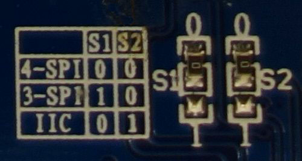

Hardware
========

It is essential that you get your device correctly wired to your single-board
computer (SBC).  The needed connections vary based upon the type of interface
your device supports.  There three major styles of interfaces that are popular
with small LCD displays.  These include I2C, SPI and 6800 style parallel-bus
interfaces.

I2C vs. SPI vs Parallel
-----------------------
If you have not yet purchased your display, you may be wondering if you should
get an I2C, SPI or parallel-bus display. The basic trade-off is implementation
complexity and speed.  The I2C is the easiest to connect because it has fewer pins
while SPI may have a faster display update rate due to running at a higher
frequency and having less overhead.  Parallel-bus displays are both slower and
harder to connect but are typically less expensive.

Identifying your interface
--------------------------
You can determine if you have an I2C, SPI or parallel-bus interface by counting
the number of pins on your card. An I2C display will have 4 pins while an SPI
interface will have 6 or 7 pins, and a parallel-bus interface will typically need
to have at least 9 pins connected on a device but can requires 16 or more
depending on the size of the bus and what other signals are required.

If you have a SPI display, check the back of your display for a configuration
such as this:

For this display, the two 0 Ohm (jumper) resistors have been connected to "0"
and the table shows that "0 0" is 4-wire SPI. That is the type of connection
that is currently supported by the SPI mode of this library.

.. tip::
  * If you don't want to solder directly on the Pi, get 2.54mm 40 pin female
    single row headers, cut them to length, push them onto the Pi pins, then
    solder wires to the headers.

  * If you need to remove existing pins to connect wires, be careful to heat
    each pin thoroughly, or circuit board traces may be broken.

  * Triple check your connections. In particular, **do not reverse VCC and GND**.

I2C
---

I2C interfaces are the simplest to wire as they contain the smallest number
of pins.  The only signal lines are serial data (SDA) and serial clock (SCL).
That plus the power and ground connections complete the required connections.

If you are using a Raspberry Pi you will normally attach to header P1.  The P1
header pins should be connected as follows:

========== ====== ============ ======== ==============
Device Pin Name   Remarks      RPi Pin  RPi Function
========== ====== ============ ======== ==============
1          GND    Ground       P01-6    GND
2          VCC    +3.3V Power  P01-1    3V3
3          SCL    Clock        P01-5    GPIO 3 (SCL)
4          SDA    Data         P01-3    GPIO 2 (SDA)
========== ====== ============ ======== ==============

.. seealso::

  Alternatively, on rev.2 RPi's, right next to the male pins of the P1 header,
  there is a bare P5 header which features I2C channel 0, although this doesn't
  appear to be initially enabled and may be configured for use with the Camera
  module.

  +------------+------+-------------+---------+---------------+-------------------------------------+
  | Device Pin | Name | Remarks     | RPi Pin | RPi Function  | Location                            |
  +============+======+=============+=========+===============+=====================================+
  | 1          | GND  | Ground      | P5-07   | GND           | .. image:: images/RPi_P5_header.png |
  +------------+------+-------------+---------+---------------+                                     |
  | 2          | VCC  | +3.3V Power | P5-02   | 3V3           |                                     |
  +------------+------+-------------+---------+---------------+                                     |
  | 3          | SCL  | Clock       | P5-04   | GPIO 29 (SCL) |                                     |
  +------------+------+-------------+---------+---------------+                                     |
  | 4          | SDA  | Data        | P5-03   | GPIO 28 (SDA) |                                     |
  +------------+------+-------------+---------+---------------+-------------------------------------+

Enabling The I2C Interface
~~~~~~~~~~~~~~~~~~~~~~~~~~
The I2C interface may not be enabled by default on your SBC.  To check if it is
enabled::

  $ dmesg | grep i2c
  [    4.925554] bcm2708_i2c 20804000.i2c: BSC1 Controller at 0x20804000 (irq 79) (baudrate 100000)
  [    4.929325] i2c /dev entries driver

or::

  $ lsmod | grep i2c
  i2c_dev                 5769  0
  i2c_bcm2708             4943  0
  regmap_i2c              1661  3 snd_soc_pcm512x,snd_soc_wm8804,snd_soc_core

If you have no kernel modules listed and nothing is showing using ``dmesg``
then this implies the kernel I2C driver is not loaded.

For Raspberry Pi OS, enable the I2C driver as follows:

#. Run ``sudo raspi-config``
#. Use the down arrow to select ``5 Interfacing Options``
#. Arrow down to ``P5 I2C``
#. Select **yes** when it asks you to enable I2C
#. Also select **yes** when it asks about automatically loading the kernel module
#. Use the right arrow to select the **<Finish>** button

After rebooting re-check that the ``dmesg | grep i2c`` command shows whether
I2C driver is loaded before proceeding. You can also
`enable I2C manually <http://elinux.org/RPiconfig#Device_Tree>`_ if the
``raspi-config`` utility is not available.

Optionally, to improve performance, increase the I2C baudrate from the default
of 100KHz to 400KHz by altering ``/boot/config.txt`` to include::

  dtparam=i2c_arm=on,i2c_baudrate=400000

Then reboot.

Next, add your user to the *i2c* group and install ``i2c-tools``::

  $ sudo usermod -a -G i2c pi
  $ sudo apt-get install i2c-tools

Logout and in again so that the group membership permissions take effect

Determining Address
~~~~~~~~~~~~~~~~~~~
Check that the device is communicating properly (if using a rev.1 board,
use 0 for the bus, not 1) and determine its address using ``i2cdetect``::

  $ i2cdetect -y 1
         0  1  2  3  4  5  6  7  8  9  a  b  c  d  e  f
    00:          -- -- -- -- -- -- -- -- -- -- -- -- --
    10: -- -- -- -- -- -- -- -- -- -- -- -- -- -- -- --
    20: -- -- -- -- -- -- -- -- -- -- -- -- -- -- -- --
    30: -- -- -- -- -- -- -- -- -- -- -- -- 3c -- -- --
    40: -- -- -- -- -- -- -- -- -- -- -- -- -- -- -- --
    50: -- -- -- -- -- -- -- -- -- -- -- -- -- -- -- --
    60: -- -- -- -- -- -- -- -- -- -- -- -- -- -- -- --
    70: -- -- -- -- -- -- -- --

The address for your device will be needed when you initialize the interface.
In the example above, the display address is 0x3c.  Keep in mind that I2C buses
can have more than one device attached. If more than one address is shown when
you run i2cdetect, you will need to determine which one is associated with your
display.  Typically displays will only support a limited set of possible
addresses (often just one).  Checking the documentation can help determine which
device is which.

SPI
---
The GPIO pins used for this SPI connection are the same for all versions of the
Raspberry Pi, up to and including the Raspberry Pi 4 B.

.. warning::
   There appears to be varying pin-out configurations on different display
   modules!  Make sure to verify the pin numbers of your device by their function
   especially VCC and GND.

========== ====== ============ ======== ==============
Device Pin Name   Remarks      RPi Pin  RPi Function
========== ====== ============ ======== ==============
1          VCC    +3.3V Power  P01-17   3V3
2          GND    Ground       P01-20   GND
3          D0     Clock        P01-23   GPIO 11 (SCLK)
4          D1     MOSI         P01-19   GPIO 10 (MOSI)
5          RST    Reset        P01-22   GPIO 25
6          DC     Data/Command P01-18   GPIO 24
7          CS     Chip Select  P01-24   GPIO 8 (CE0)
========== ====== ============ ======== ==============

.. note::

  * If you're already using the listed GPIO pins for Data/Command and/or Reset,
    you can select other pins and pass :py:attr:`gpio_DC` and/or :py:attr:`gpio_RST`
    argument specifying the new *GPIO* pin numbers in your serial interface create
    call (this applies to PCD8544, ST7567 and ST7735).

  * Because CE is connected to CE0, the display is available on SPI port 0. You
    can connect it to CE1 to have it available on port 1. If so, pass
    :py:attr:`port=1` in your serial interface create call.

  * When using the 4-wire SPI connection, Data/Command is an "out of band" signal
    that tells the controller if you're sending commands or display data. This
    line is not a part of SPI and the library controls it with a separate GPIO
    pin. With 3-wire SPI and I2C, the Data/Command signal is sent "in band".

  * If you're already using the listed GPIO pins for Data/Command and/or Reset,
    you can select other pins and pass a ``gpio_DC`` and/or a ``gpio_RST``
    argument specifying the new *BCM* pin numbers in your serial interface create
    call.

  * The use of the terms 4-wire and 3-wire SPI are a bit confusing because in
    most SPI documentation, the terms are used to describe the regular 4-wire
    configuration of SPI and a 3-wire mode where the input and output lines, MOSI
    and MISO, have been combined into a single line called SISO. However, in the
    context of these OLED controllers, 4-wire means MOSI + Data/Command and 3-wire
    means Data/Command sent as an extra bit over MOSI.

Enabling The SPI Interface
~~~~~~~~~~~~~~~~~~~~~~~~~~
To enable the SPI port on a Raspberry Pi running Raspbian::

    $ sudo raspi-config
    > Advanced Options > A6 SPI

If ``raspi-config`` is not available, enabling the SPI port can be done
`manually <http://elinux.org/RPiconfig#Device_Tree>`_.

Ensure that the SPI kernel driver is enabled::

  $ ls -l /dev/spi*
  crw-rw---- 1 root spi 153, 0 Nov 25 08:32 /dev/spidev0.0
  crw-rw---- 1 root spi 153, 1 Nov 25 08:32 /dev/spidev0.1

or::

  $ lsmod | grep spi
  spi_bcm2835             6678  0

Then add your user to the *spi* and *gpio* groups::

  $ sudo usermod -a -G spi,gpio pi

Log out and back in again to ensure that the group permissions are applied
successfully.

Parallel
--------

Beyond the power and ground connections, you can choose which ever GPIO pins
you like to connect up your display.  The following is one example for how to
wire popular displays such as the Winstar WEH001602A.

========== ====== ================ ======== ==============
Device Pin Name   Remarks          RPi Pin  RPi Function
========== ====== ================ ======== ==============
1          GND    Ground           P01-6    GND
2          VDD    +5.0V Power      P01-2    5V Power
3          NC     Not Connect
4          RS     Register Select  P01-26   GPIO 7
5          R/W    Read/Write       P01-14   GND
6          E      Enable           P01-24   GPIO 8
7          D0     Not Connected
8          D1     Not Connected
9          D2     Not Connected
10         D3     Not Connected
11         D4     Databus line 4   P01-22   GPIO 25
12         D5     Databus line 5   P01-18   GPIO 24
13         D6     Databus line 6   P01-16   GPIO 23
14         D7     Databus line 7   P01-13   GPIO 27
15         NC     Not Connect
16         NC     Not Connect
========== ====== ================ ======== ==============

.. note::
  * You have the choice on whether to wire your device with 4 or 8 data-lines.
    Wiring with 8 provides a faster interface but at the cost of increased wiring
    complexity.  Most implementations use 4 data-lines which provides acceptable
    performance and is the default setting for the parallel class.

  * Reading from the display is not supported by the
    :py:class:`luma.core.interface.parallel.bitbang_6800` class so it needs
    to be connected to ground in order to always be set for writes (assuming the
    device uses logic-low for write).

.. warning::
  * Be careful with the logic level of the device you are using.  Many SBCs
    including the Raspberry Pi uses 3.3V logic.  If your device supplies 5V to
    one of the GPIO pins of an SBC that uses 3.3V logic, you may damage your SBC.
