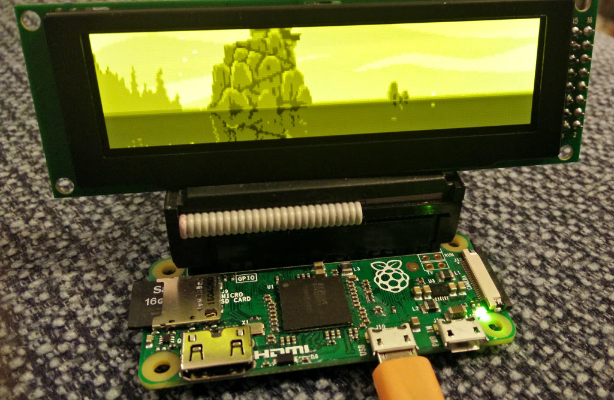
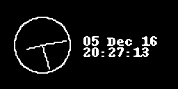
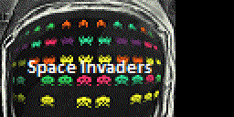
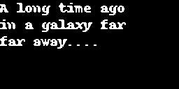

Introduction
------------
Interfacing `OLED matrix displays
<https://github.com/rm-hull/luma.oled/wiki/Usage-&-Benchmarking>`_ with the
SSD1306, SSD1322, SSD1325, SSD1331 or SH1106 driver in Python 2 or 3 using
I2C/SPI on the Raspberry Pi and other linux-based single-board computers: the
library provides a Pillow-compatible drawing canvas, and other functionality
to support:

* scrolling/panning capability,
* terminal-style printing,
* state management,
* color/greyscale (where supported),
* dithering to monochrome

The SSD1306 display pictured below is 128 x 64 pixels, and the board is `tiny`,
and will fit neatly inside the RPi case. 

.. image:: images/mounted_display.jpg
   :alt: mounted

.. seealso::
   Further technical information for the specific devices can be found in the
   datasheets below: 
   
   - :download:`SSD1306 <tech-spec/SSD1306.pdf>`
   - :download:`SSD1322 <tech-spec/SSD1322.pdf>`
   - :download:`SSD1325 <tech-spec/SSD1325.pdf>`
   - :download:`SSD1331 <tech-spec/SSD1331.pdf>`
   - :download:`SH1106 <tech-spec/SH1106.pdf>`

   Benchmarks for tested devices can be found in the
   `wiki <https://github.com/rm-hull/luma.oled/wiki/Usage-&-Benchmarking>`_.

As well as display drivers for various physical OLED devices there are
emulators that run in real-time (with pygame) and others that can take
screenshots, or assemble animated GIFs, as per the examples below (source code
for these is available in the `luma.examples <https://github.com/rm-hull/luma.examples>`_ 
git repository:

