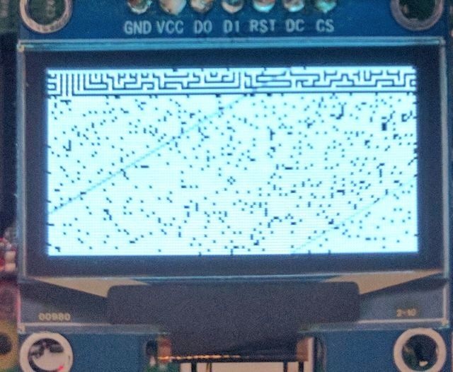

Troubleshooting
---------------

Corrupted display due to using incorrect driver
^^^^^^^^^^^^^^^^^^^^^^^^^^^^^^^^^^^^^^^^^^^^^^^

Using the SSD1306 driver on a display that has a SH1106 controller can result in
the display showing a small section of the expected output with the rest of the
display consisting of semi-random pixels (uninitialized memory).

  Display corruption due to using driver for incorrect controller when running
  the `maze.py` example

This is due to differences in required initialization sequences and how memory
is mapped in the two controllers.

The included examples default to the SSD1306 driver. To use the SH1106 driver
instead, include the `--display sh1106` command line switch. To use the SSH1106
driver in code, use the `luma.oled.device.sh1106` serial interface class.
